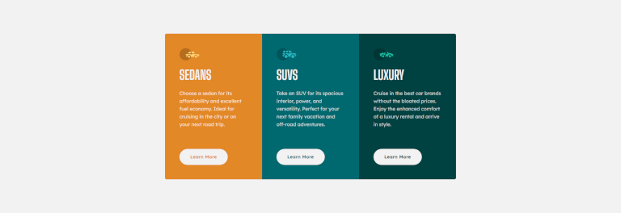

 # Frontend Mentor - 3-column preview card component

This is a solution to the [3-column preview card component challenge on Frontend Mentor](https://www.frontendmentor.io/challenges/3column-preview-card-component-pH92eAR2-). Frontend Mentor challenges help you improve your coding skills by building realistic projects. 

### Screenshot

- Live Site URL: https://taavi80.github.io/3-column-preview-card-component/

### Built with
- CSS custom properties
- Flexbox

## Author
- Website - [taavi80](https://www.frontendmentor.io/profile/taavi80)

